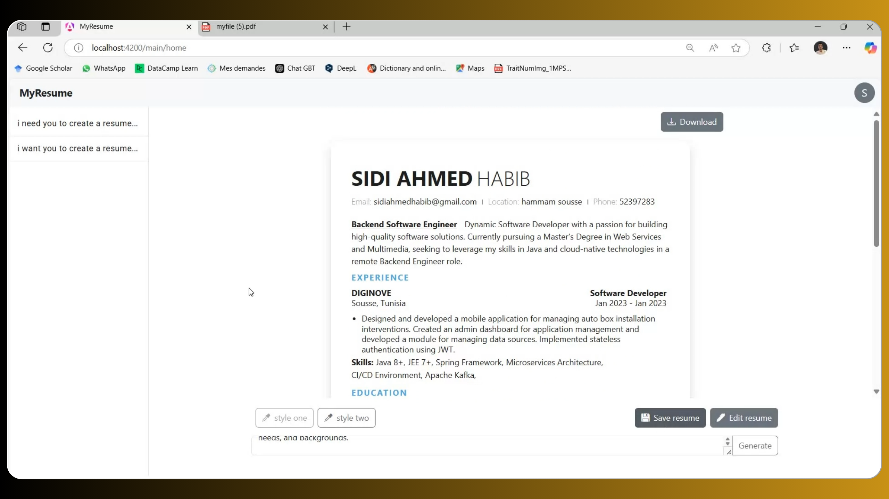
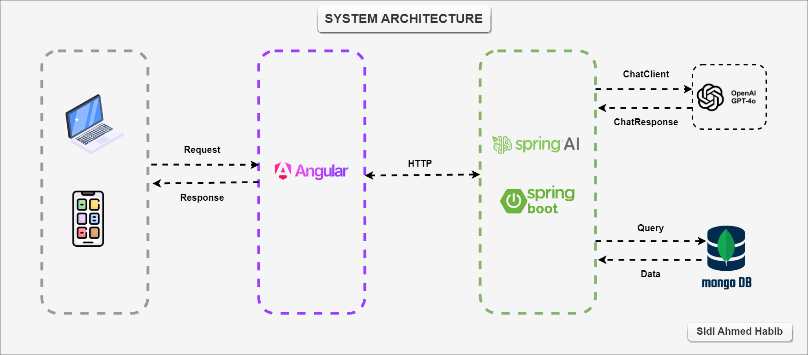

# MyResume | AI-Powered Resume Generator

## Table of Contents
- [Overview](#overview)
- [System Architecture](#system-architecture)
- [Demo](#demo)
- [Technologies](#technologies)
- [Getting Started](#getting-started)
- [License](#license)
- [My Links](#my-links)

## Overview
Writing resumes that match job descriptions can take a lot of time and effort. To address this, I created **MyResume**, an AI-powered application that generates **ATS-friendly PDF resumes** in just a few seconds, simplifying the process and increasing efficiency.



### Key Features:
- **AI-Powered Personalization**: Generates resumes customized to fit job descriptions.
- **ATS-Friendly Templates**: Increases the likelihood of passing ATS screenings.
- **Customizable Styles**: Allows users to fine-tune resume formats to match their preferences.
- **Fast and Efficient**: Saves time by automating the resume creation process.

This app leverages cutting-edge AI technologies to streamline resume creation, helping job seekers enhance their chances of success in today's competitive job market.

## System Architecture



#### Components:
1. **Frontend (Angular)**:
   - Interactive UI for users to input job descriptions, customize resumes, and download PDF resumes.

2. **Backend (Spring Boot with SpringAI)**:
   - Handles requests and integrates the **OpenAI GPT-4** model for prompt engineering and AI-driven resume creation.

3. **Database (MongoDB)**:
   - Stores user profiles, preferences, and resume data for seamless operations.

4. **Containerization (Docker)**:
   - Ensures smooth deployment and scalability of the entire application.
## Demo
Want to see MyResume in action? Check out this quick demo video showcasing how the application generates resumes:  

[](https://www.youtube.com/watch?v=_CQ92JVSSTU)  

*Click on the image to watch the demo on YouTube.*

## Technologies
- **Frontend**: Angular
- **Backend**: Spring Boot, SpringAI, OpenAI API (GPT-4)
- **Database**: MongoDB
- **Containerization**: Docker


## Getting Started

### Prerequisites
- **Java 21+**
- **Node.js**
- **MongoDB**
- **Docker**

### Steps

1. Clone the repository:
   ```bash  
   git clone https://github.com/SidiahmedHABIB/my-resume-project 
   cd my-resume-project
   ```  

2. Build the backend Docker image:
   ```bash
   cd docker/backend
   docker build -t my-resume-backend .
   cd ../..
   ```

3. Build the frontend Docker image:
   ```bash
   cd docker/frontend
   docker build -t my-resume-frontend .
   cd ../..
   ```

4. Start the entire application using Docker Compose:
   ```bash
   docker-compose up
   ```

5. Access the application:
   - **Frontend**: Open your browser and go to [http://localhost:4200](http://localhost:4200).

## License
This project is licensed under the MIT License - see the [LICENSE](LICENSE) file for details.

## My Links
[](https://www.facebook.com/habib.sidiahmed.5)  
[](https://www.linkedin.com/in/sidi-ahmed-habib-18163220a/)
